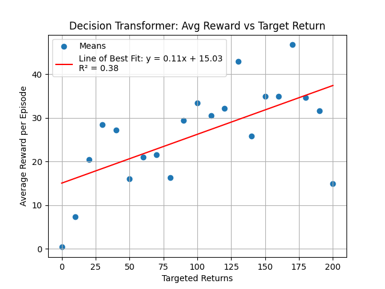

# Decision Transformer

A reproduction of the Decision Transformer paper. Not meant to be 100% faithful to the original, but rather a proof-of-concept for the idea.

I documented my process in this Twitter thread: https://x.com/jinaycodes/status/1917207946406105296

I ran the final trained weights and conditioned it on different targeted return each time, with 50 episodes per targeted return. The graph below shows a weak correlation between the conditioning value and the average reward per episode that the transformer has learned.

Here's a demo of the final weights in action:

https://github.com/user-attachments/assets/7616d5fc-2e06-4351-aa09-e13d6b292035

